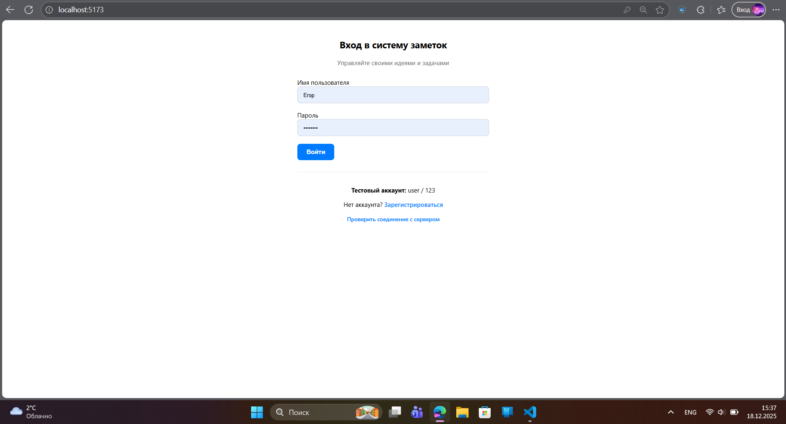
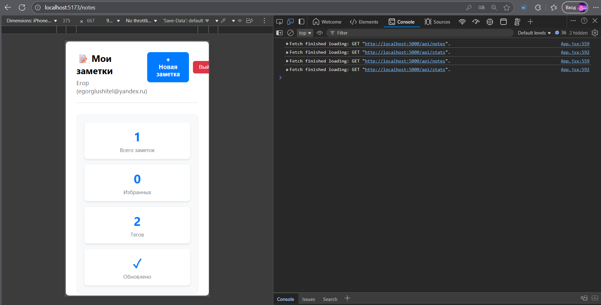
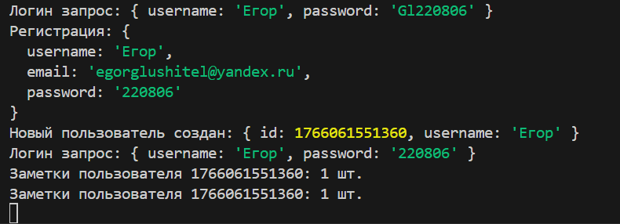
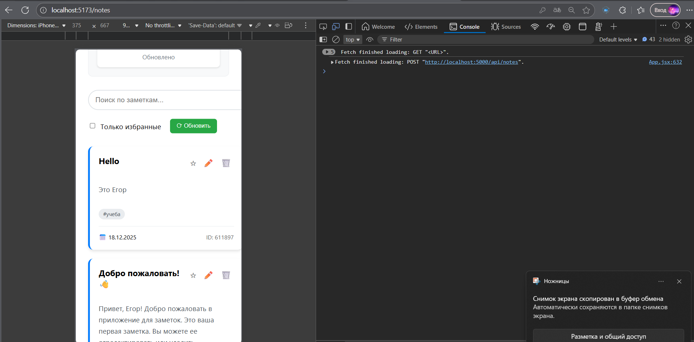

# Zametki with server - реакт приложение для создания заметок с рабочим базовым сервером

## Скриншоты

### Все API

### Страница входа

### Страница авторизации

### Авторизация на сервере

### Авторизация на сервере

### Создание заметки

### Создание заметки

### Редактирование заметки

### Редактирование заметки

## Все заметки хранятся на сервере

# Выполнил работу Глущенко Егор (ЭФБО-09-24)
